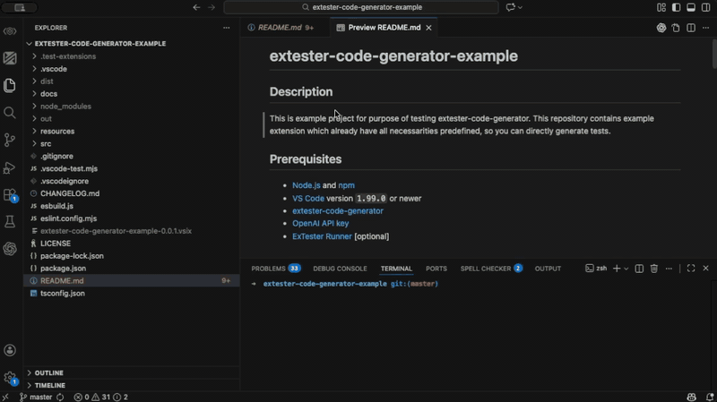

<h1 align="center">
  
  <br>
  <a href="https://github.com/redhat-developer/vscode-extension-tester">ExTester</a> Code Generator
</h1>

<p align="center">
  <a href="https://github.com/pospisilf/extester-code-generator"></a>
  
  <a href="https://github.com/pospisilf/extester-code-generator/blob/main/LICENSE"></a>
  <a href="https://github.com/pospisilf/extester-code-generator/actions/workflows/main.yaml"></a>
  <a href="https://github.com/pospisilf/extester-code-generator/actions/workflows/generate-vsix.yaml"></a>
</p>

<p align="center">
  <span style="background-color:#fff4cc;color:#7a4b00;padding:4px 10px;border-radius:6px;font-weight:600;">
    Note: This extension is a proof of concept built as part of a master's thesis and is not production-ready.
  </span>
</p>

<p align="center">
  <a href="#what-is-this">Description</a> •
  <a href="#features">Features</a> •
  <a href="#requirements">Requirements</a> •
  <a href="#configuration">Configuration </a> •
  <a href="#usage">Usage</a> •
  <a href="#notes-and-limitations">Notes and limitations</a> •
  <a href="#contact">Contact</a> •
  <a href="#issues">Issues</a>
</p>

<p align="center">
  Generate and automatically fix UI tests for VS Code extensions using AI and the <a href="https://github.com/redhat-developer/vscode-extension-tester">ExTester</a> framework.
</p>

<p align="center">
  
</p>

## What is this

ExTester Code Generator is a Visual Studio Code extension that helps you bootstrap and maintain UI test suites for your own VS Code extensions.

It analyzes your extension’s `package.json`, asks OpenAI models for suitable UI test scenarios, generates ExTester-based TypeScript test files, and then helps you iteratively fix compilation and runtime failures using AI.

The extension is designed to sit on top of an existing ExTester setup: you keep control of your test runner and project structure, while the generator handles the repetitive work of drafting and repairing tests.

> **Tip:** Try the example project for a quick, known-good setup.  
> Example: [extester-code-generator-example](https://github.com/pospisilf/extester-code-generator-example)  
> It includes a minimal VS Code extension with ExTester configuration and README guidance on the test command to use, so you can install this generator and run through the full workflow quickly.

## Features

At a high level, the extension provides a three-step workflow:

1. **Generate Test Proposals**
   - Reads your workspace `package.json` and extracts relevant contribution metadata.
   - Sends a structured prompt to OpenAI (`gpt-5`) to generate a JSON list of UI test proposals (categories, names, descriptions, coverage areas).
   - Creates a `src/ui-test` folder (if it does not exist) and organizes proposed tests into subfolders by category.
   - For each proposal, it either:
     - Creates a minimal placeholder test file, or
     - Uses OpenAI (`gpt-5-codex`) to generate a full TypeScript test file that uses ExTester.

2. **Fix Compilation Issues**
   - Runs your workspace UI tests by invoking an existing npm script.
   - Parses compiler and test output to detect failing test files and error locations.
   - Builds an AI prompt with the failure output, current test content, and extension context, and asks OpenAI to rewrite the broken test file.
   - Writes the fixed TypeScript test back into your workspace.

3. **Fix Runtime Failures**
   - Discovers UI test files under `src/ui-test/**`.
   - Runs each test file individually (through ExTester / `extest`) and collects stdout/stderr.
   - Classifies failures as likely runtime issues (timeouts, missing elements, flaky behavior, navigation problems, etc.).
   - For each runtime failure, asks OpenAI to produce a more robust version of the test (better waits, navigation, selectors, retries) and updates the test file.
   - Re-runs the fixed tests to verify that the failure has been resolved.

### What can it do for you?

- Analyze your VS Code extension manifest and propose realistic UI test scenarios.
- Generate ExTester-based TypeScript test files using OpenAI.
- Create a structured `src/ui-test/<category>/<test-name>.test.ts` layout.
- Run your existing UI test script and collect output.
- Use AI to:
  - Fix tests that fail to compile (syntax/type errors).
  - Fix tests that fail at runtime (timeouts, missing elements, flakiness).
- Re-run tests after applying fixes to confirm improvements.
- Provide a dedicated **Generator View** in the Activity Bar with buttons for:
  - **Generate Test Proposals**
  - **Fix Compilation Issues**
  - **Fix Runtime Failures**

The extension focuses on UI tests built on top of ExTester (`vscode-extension-tester`). It does not replace your test runner or ExTester configuration; instead, it automates test creation and repair on top of whatever you already use.

## Requirements

To use ExTester Code Generator effectively, you need:

- **Visual Studio Code** `^1.99.0` or newer.
- **An existing VS Code extension workspace**, with:
  - A `package.json` at the workspace root.
  - A UI test script:
    - `"ui-test": "..."`
      that runs your ExTester / `vscode-extension-tester` UI tests (via `extest`).
- **Node.js and npm** on your PATH, so `npm run <script>` works from the workspace root.
- **ExTester / vscode-extension-tester** set up in your project
- **OpenAI account and API key**:
  - The extension uses the official `openai` Node.js library.
  - It currently calls:
    - `gpt-5` via the Chat Completions API for natural language reasoning and test proposal generation.
    - `gpt-5-codex` via the Responses API for code generation and test fixes.
  - Usage is billed against your OpenAI account according to the models’ pricing.

Without a valid OpenAI API key, commands that rely on AI will show a clear error and not perform generation/fixing.

## Configuration

All extension-specific settings live under the `extester-code-generator` namespace in VS Code settings (`Settings` UI or `settings.json`).

### OpenAI API key

- **Setting:** `extester-code-generator.apiKey`
- **Type:** string
- **Purpose:** Your OpenAI API key used for all calls to the OpenAI API.

You must set this before running. If this value is missing, the extension will show:  
`OpenAI API key missing. Set extester-code-generator.apiKey in settings and try again.`

### Limiting generated tests

- **Setting:** `extester-code-generator.maxGeneratedTests`
- **Type:** number or `null`
- **Default:** `null` (no limit)
- **Purpose:** Optional upper bound on how many proposals are turned into test files in a single run.

If set to a positive integer, only that many proposals (from the front of the AI-generated list) will be converted into test files. The rest are ignored for that run.

### Related ExTester configuration (in your workspace)

The generator expects your project to already be wired for ExTester UI tests. In practice this usually means:

- An npm script such as:

  ```json
  {
    "scripts": {
      "ui-test": "extest setup-and-run",
      "test": "npm run ui-test"
    }
  }
  ```

Note: The test test trigger is implemented as a copy of the <a href="https://github.com/redhat-developer/vscode-extension-tester/tree/main/packages/extester-runner">ExTester runner</a> so in case you have configured this extension with some settings, following of them will be used:

- Optionally, ExTester-specific settings (for the ExTester runner extension), for example:
  - `extesterRunner.outputFolder` – where compiled tests live (e.g. `out`).
  - `extesterRunner.rootFolder` – logical root of your test sources.
  - `extesterRunner.tempFolder` – optional temporary storage for test runs.
  - `extesterRunner.visualStudioCode.Version` and `extesterRunner.visualStudioCode.Type` – VS Code version and flavor for running tests.

Those settings are owned by the ExTester runner; this generator simply uses them when running individual test files.

## Usage

### 1. Install and open your target extension project

1. Install **ExTester Code Generator** in VS Code.
2. Open the folder containing your VS Code extension (with `package.json` at the root).
3. Ensure your UI test script (`ui-test`) runs successfully (even if tests are currently failing).
4. Configure ExTester (and its runner) as usual so `npm run ui-test` triggers your UI tests.

### 2. Configure OpenAI access

1. Open VS Code **Settings**.
2. Search for `ExTester Code Generator`.
3. Set **OpenAI API Key** (`extester-code-generator.apiKey`) to your API key.
4. Optionally set **Max Generated Tests** (`extester-code-generator.maxGeneratedTests`) to limit how many tests are created in one batch.

### 3. Generate test proposals and files

You can use either the Activity Bar view or the Command Palette:

- **Generator View (recommended):**
  - Open the **ExTester Code Generator** view from the Activity Bar.
  - Click **Generate Test Proposals**.

- **Command Palette:**
  - Run `ExTester Code Generator: Generate Test Proposals`.

The extension will:

- Analyze your `package.json`.
- Ask OpenAI for proposals.
- Create `src/ui-test` and category subfolders if needed.
- Write new `.test.ts` files under `src/ui-test/<category>/<test-name>.test.ts`.

### 4. Fix compilation issues

If your tests fail to compile:

- Use the **Generator View** and click **Fix Compilation Issues**, or
- Run `ExTester Code Generator: Fix Compilation Issues` from the Command Palette.

The extension will:

- Run your UI test script.
- Parse compiler output and identify failing test files.
- Ask OpenAI for a corrected TypeScript file.
- Save the updated test file into your workspace.

### 5. Fix runtime failures

Once compilation errors are resolved but tests still fail at runtime:

- Use **Fix Runtime Failures** from the Generator View, or
- Run `ExTester Code Generator: Fix Runtime Failures` from the Command Palette.

The extension will:

- Discover tests under `src/ui-test/**`.
- Run each file individually.
- Parse failures and classify runtime issues.
- Ask OpenAI to make the tests more robust (better waits, navigation, selectors, retries).
- Write the fixed tests and re-run them to verify.

## Notes and limitations

- AI-generated tests and fixes should be treated as suggestions. You are responsible for reviewing and maintaining them.
- The quality of proposals and fixes heavily depends on:
  - How well your extension is described in `package.json`.
  - The completeness of your existing ExTester setup.
- The extension does not:
  - Configure ExTester for you.
  - Guarantee that generated tests are logically correct for your specific domain.

## Contact

If you have questions, feedback, or ideas for improvements, you can reach the maintainer via GitHub:

- Profile: https://github.com/pospisilf

Pull requests and suggestions are welcome.

## Issues

Please report bugs, feature requests, and usability issues on the GitHub issue tracker:

- Issues: https://github.com/pospisilf/extester-code-generator/issues

When filing an issue, include:

- VS Code version.
- Operating system.
- A short description of your ExTester setup (`package.json` scripts, `src/ui-test` layout).
- Any relevant output from the **ExTester Code Generator** output channel and your test runner.
